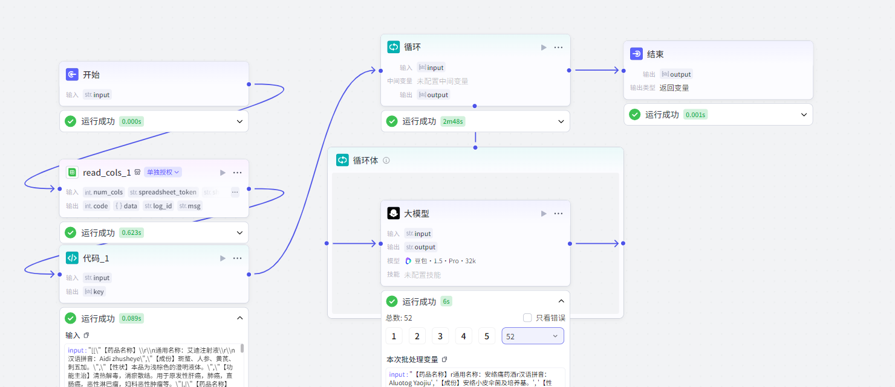
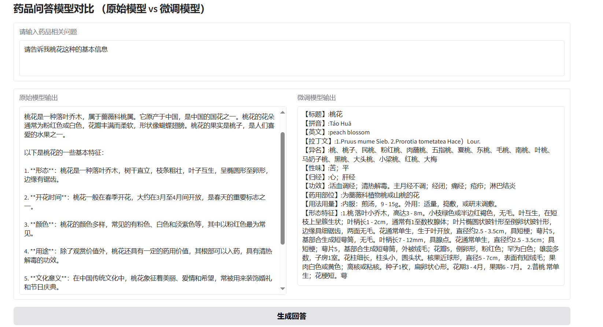

# Qwen2.5_1.5B_Instruct LoRA 微调项目

本项目旨在对 Qwen2.5_1.5B_Instruct 模型进行 LoRA 微调，以构建针对药品问答的定制大语言模型。项目包含从数据爬取、处理到模型微调及效果展示的完整流程。

---

## 环境配置

本项目建议在 Linux 系统下运行，并使用 Python 3.10 以上版本。

### Python 依赖

```bash
python3.10 -m venv venv
source venv/bin/activate

pip install --upgrade pip
pip install torch torchvision torchaudio --index-url https://download.pytorch.org/whl/cu118
pip install transformers datasets accelerate peft coze gradio
````

### CUDA 支持

* CUDA >= 11.8，确保 PyTorch 能够使用 GPU 训练。
* 检查 CUDA 是否可用：

```python
import torch
print(torch.cuda.is_available())
```

---

## 数据获取与处理

### 数据爬取

项目通过爬虫获取主流医药网站的药品问答数据，得到原始文本数据文件。

### Coze 工作流处理

使用 Coze 平台对爬取的原始数据进行清洗、分类和结构化处理，生成微调语料。

#### 工作流示意图



### 指令微调数据格式示例

```json
[
  {
    "instruction": "请根据输入的药品名称，输出规范化的药品信息，根据已有的信息格式化输出，尽量让药品的信息输出最多",
    "input": "我想了解一下广东凉茶的详细信息，能给我说说吗？",
    "output": "【通用名称】:广东凉茶 \n【汉语拼音】:Guagdog Liagcha \n【成份】:岗梅根、金樱根、金沙藤、五指柑、火炭母、山芝麻、广金钱草、淡竹叶、布渣叶、木蝴蝶 \n【性状】:本品为原药材的片、段（包装）或棕褐色粗粉末状（袋泡装）药茶；气微，味苦、甘 \n【功能主治】:清热解暑，去湿生津。用于四时感冒，发热喉痛，湿热积滞，口干尿黄 \n"
  },
  {
    "instruction": "请根据输入的药品名称，输出规范化的药品信息，根据已有的信息格式化输出，尽量让药品的信息输出最多",
    "input": "能给我说说广东凉茶（片段包装）的详细信息吗？",
    "output": "【药品名称】:广东凉茶（片段包装）\n【汉语拼音】:a dog liag cha(pia dua bao zhuag)\n【成份】:岗梅根、木蝴蝶、淡竹叶、金沙藤、火炭母、五指柑、金樱根、布渣叶、山芝麻、广金钱草\n【性状】:本品为原药材的片、段(包装)；气微，味苦、甘\n【功能主治】:清热解暑，去湿生津。用于四时感冒，发热喉痛，湿热积滞，口干尿黄"
  }

]
```

---

## 微调后的模型对比 Gradio 界面



---

## 参考

* [Coze 平台](https://space.coze.cn/?utm_source=baidu_pz&utm_medium=sem&utm_term=coze_baidu_pz_pc_czkj&utm_campaign=6353598&utm_content=home&utm_id=0&utm_source_platform=pc&category=7524912604796452873)
* [Qwen2.5_1.5B_Instruct模型库](https://modelscope.cn/models/Qwen/Qwen2.5-1.5B-Instruct)


